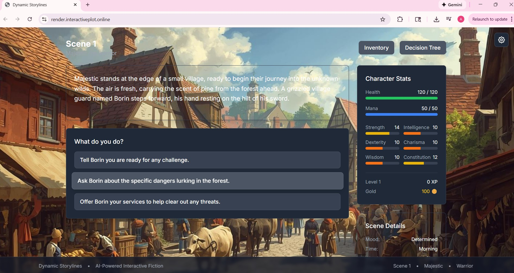

# 🎮 Dynamic Storylines – AI-Powered Interactive Story Game

A **full-stack interactive storytelling game** powered by **Gemini AI**, deployed using **production-grade AWS infrastructure**.

This project demonstrates **end-to-end system design** — from AI-powered narrative generation and stateful backend logic to containerized deployment using **Terraform, ECS Fargate, and GitHub Actions**.

---

## 🌐 Live Access

- **Public Demo:** https://www.render.interactiveplot.online  
(Vercel-hosted preview; AWS ECS is the production-grade reference architecture)
- **Production Domain:** https://interactiveplot.online *(available on request)*

---

## 🎲 How the Game Works

An **interactive narrative experience** where your choices shape a unique story across **20 scenes**.

**Gameplay Flow:**

1. **Opening Scene:** Gemini AI generates a dynamic starting scenario
2. **Player Decisions:** Choose from 2-4 options at each scene
3. **Story Progression:** Each choice advances the narrative (up to 20 scenes total)
4. **AI-Driven Adaptation:** An intelligent agent tracks your decisions, character stats, inventory, and world events
5. **Branching Paths:** Your choices create consequences that affect future scenes
6. **Unique Endings:** After 20 scenes, your accumulated decisions determine the outcome

**The AI Agent Architecture:**

Unlike simple prompt-based generation, this uses a **stateful AI agent** that maintains:
- Complete scene history for narrative coherence
- Player decision tracking
- Character attributes (health, inventory, relationships)
- World state flags (events triggered, locations discovered)
- Consequence logic that creates meaningful, lasting impacts

Each scene generation includes full context, enabling the AI to create coherent, branching narratives where choices truly matter.

---

## 🖼️ Game Screenshot

**Main gameplay interface**



*Player navigating through an AI-generated scene with decision options*

---

## 🏗️ Architecture Overview

### AWS Infrastructure Diagram


*Complete AWS architecture showing VPC with multi-AZ deployment, ECS Fargate services for frontend/backend, RDS PostgreSQL in private subnets, Application Load Balancer*

### Core Components

- **VPC:** Multi-AZ setup with public/private subnet isolation
  - **Public Subnets (2 AZs):** ALB + ECS Fargate tasks
  - **Private Subnets (2 AZs):** RDS PostgreSQL (no internet access)
- **ECS Fargate:** Serverless container orchestration for frontend and backend
  - **Cost Optimization:** Tasks in public subnets (no NAT Gateway required)
  - **Security:** Inbound traffic restricted to ALB via security groups
  - **Outbound Access:** Direct internet connectivity for Gemini API calls
- **RDS PostgreSQL:** Managed database for game state and decision history
- **Application Load Balancer:** Traffic distribution
- **Route 53 + ACM:** Custom domain DNS and SSL/TLS certificates
- **ECR:** Private Docker image registry
- **SSM Parameter Store:** Secure secrets and configuration management
- **S3 + DynamoDB:** Terraform state storage with locking for safe concurrent operations

---

## 🚀 Deployment Guide (AWS Production)

### Prerequisites

- AWS Account with appropriate permissions
- AWS CLI configured (`aws configure`)
- Terraform installed (v1.0+)
- Docker installed
- PostgreSQL client tools
- Domain name (optional, for custom domain)

### Step 1: Clone the Repository

```bash
git clone https://github.com/ayalagellis/ai-game.git
cd ai-game
```

### Step 2: Store Application Secrets

Store sensitive credentials in AWS SSM Parameter Store before deployment:

```bash
# Gemini API key (required for AI story generation)
aws ssm put-parameter \
  --name "/ai-game/gemini-api-key" \
  --value "your-actual-gemini-api-key" \
  --type "SecureString" \
  --region us-east-1

# Database password (required for RDS)
aws ssm put-parameter \
  --name "/ai-game/db-password" \
  --value "YourSecurePassword123!" \
  --type "SecureString" \
  --region us-east-1
```

**⚠️ IMPORTANT:** 
- Replace `"your-actual-gemini-api-key"` with your real Gemini API key
- Use a strong database password (min 8 characters, mix of letters/numbers/symbols)
- These secrets are injected into ECS tasks at runtime via SSM

### Step 3: Set Up AWS Infrastructure

**Deploy infrastructure modules in order:**

```bash
# 1. Bootstrap (S3 backend for Terraform state)
cd infrastructure/bootstrap
terraform init
terraform apply

# 2. VPC and Networking
cd ../vpc
terraform init
terraform apply

# 3. SSM Parameter Store (Secrets)
cd ../ssm
terraform init
terraform apply

# 4. RDS PostgreSQL Database
cd ../rds
terraform init
terraform apply

# 5. ECR Repositories
cd ../ecr  
terraform init
terraform apply

# 6. ECS Cluster and Services (includes ALB)
cd ../ecs
terraform init
terraform apply
```

### Step 4: Build and Push Docker Images

**Get your AWS credentials:**

```bash
# Get AWS Account ID
AWS_ACCOUNT_ID=$(aws sts get-caller-identity --query Account --output text)
AWS_REGION="us-east-1"

echo "AWS Account ID: $AWS_ACCOUNT_ID"
```

**Authenticate with ECR:**

```bash
aws ecr get-login-password --region $AWS_REGION | \
  docker login --username AWS --password-stdin \
  ${AWS_ACCOUNT_ID}.dkr.ecr.${AWS_REGION}.amazonaws.com
```

**Build Docker images:**

```bash
# Return to project root
cd ../..

# Build Docker image
docker compose -f docker/docker-compose.yml build
```

**Tag and push to ECR:**

```bash
# Backend
docker tag ai-game-backend:latest \
  ${AWS_ACCOUNT_ID}.dkr.ecr.${AWS_REGION}.amazonaws.com/ai-game-backend:latest
  
docker push ${AWS_ACCOUNT_ID}.dkr.ecr.${AWS_REGION}.amazonaws.com/ai-game-backend:latest

# Frontend
docker tag ai-game-frontend:latest \
  ${AWS_ACCOUNT_ID}.dkr.ecr.${AWS_REGION}.amazonaws.com/ai-game-frontend:latest
  
docker push ${AWS_ACCOUNT_ID}.dkr.ecr.${AWS_REGION}.amazonaws.com/ai-game-frontend:latest
```

### Step 5: Deploy to ECS (Optional)

**Update ECS services with new images:**

```bash
cd infrastructure/ecs

# Force new deployment (pulls latest images from ECR)
aws ecs update-service \
  --cluster ai-game-cluster \
  --service backend-service \
  --force-new-deployment \
  --region us-east-1

aws ecs update-service \
  --cluster ai-game-cluster \
  --service frontend-service \
  --force-new-deployment \
  --region us-east-1
```

### Step 6: Access Application

**Get the Application Load Balancer URL:**

```bash
terraform output -raw alb_dns_name
```

**Access your application:**

```
https://<ALB-DNS-NAME>
```

### Step 7: Custom Domain Setup (Optional)

If using a custom domain like `interactiveplot.online`:

1. **Create Route 53 Hosted Zone** (if not exists)
2. **Update domain nameservers** at your registrar (e.g., GoDaddy)
3. **Request ACM Certificate:**
   ```bash
   aws acm request-certificate \
     --domain-name interactiveplot.online \
     --validation-method DNS \
     --region us-east-1
   ```
4. **Add DNS validation records** to Route 53
5. **Update ALB listener** to use ACM certificate
6. **Create Route 53 A record** (Alias) pointing to ALB

> ACM certificates must be created in the same region as the Application Load Balancer.

---

## 🔁 CI/CD Pipeline (GitHub Actions)

Automated deployment on every push to `main` branch.

### Required GitHub Secrets

Configure in `Settings > Secrets and variables > Actions`:

**Secrets:**
- `AWS_ACCESS_KEY_ID` - IAM access key with ECR and ECS permissions
- `AWS_SECRET_ACCESS_KEY` - IAM secret key
- `AWS_REGION` - Deployment region (e.g., `us-east-1`)

**Variables:**
- `ECR_BACKEND_REPO` - Backend ECR repository URI
- `ECR_FRONTEND_REPO` - Frontend ECR repository URI
- `ECS_CLUSTER` - ECS cluster name
- `ECS_BACKEND_SERVICE` - Backend ECS service name
- `ECS_FRONTEND_SERVICE` - Frontend ECS service name

### Pipeline Workflow

```yaml
Trigger: Push to main
  ↓
Build Docker images (backend + frontend)
  ↓
Run tests
  ↓
Push images to ECR with :latest and :commit-sha tags
  ↓
Update ECS task definitions
  ↓
Deploy to ECS (rolling update, zero downtime)
  ↓
Send Slack notification with deployment status
```

---

## 📡 API Endpoints

```
POST   /api/game/start              # Start new game with character
POST   /api/next-scene              # Progress to next scene with player choice
GET    /api/game-state/:characterId # Retrieve current game state
GET    /api/get-character/:id       # Get character details
GET    /api/decision-tree/:characterId # Get visualization data
GET    /api/health                  # Health check
```

---

## 🛠️ Tech Stack

**Frontend:**
- React 18 + TypeScript
- Zustand (state management)
- TailwindCSS (styling)

**Backend:**
- Node.js + Express + TypeScript
- Gemini AI (Google)
- PostgreSQL

**Infrastructure:**
- AWS ECS Fargate (container orchestration)
- AWS RDS PostgreSQL (database)
- AWS ALB (load balancing + HTTPS)
- AWS ECR (container registry)
- AWS Route 53 (DNS)
- AWS Certificate Manager (SSL/TLS)
- AWS SSM Parameter Store (secrets)
- Terraform (Infrastructure as Code)
- GitHub Actions (CI/CD)
- Docker (containerization)

---

## 🔒 Security Features

- **HTTPS Enforced:** TLS 1.2+ encryption for all traffic
- **Secrets Management:** AWS SSM Parameter Store (no hardcoded credentials)
- **Network Isolation:** RDS in private subnets, no public internet access
- **Security Groups:** Least-privilege firewall rules
- **IAM Roles:** Task-level permissions with minimal scope
- **Encryption at Rest:** RDS storage encryption enabled
- **Container Security:** Regular image scanning, non-root users

**Trade-off Note:** ECS tasks run in public subnets to avoid NAT Gateway costs (suitable for portfolio projects) while maintaining security through security group rules.

---

## 🧪 Why This Project Matters

This project demonstrates:

✅ **AI Agent Architecture** - Stateful reasoning with memory, not just prompt completion  
✅ **Production Infrastructure** - Real AWS deployment, not toy localhost setup  
✅ **DevOps Best Practices** - IaC, CI/CD, containerization, secrets management  
✅ **Full-Stack Development** - Modern React, Node.js, PostgreSQL, TypeScript  
✅ **Security-First Design** - HTTPS, IAM, network isolation, encrypted storage  
✅ **Scalability** - Auto-scaling ECS tasks, multi-AZ RDS, load balancing

---